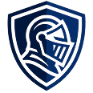
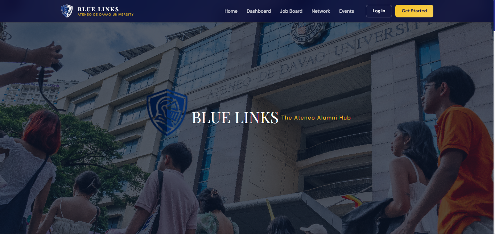
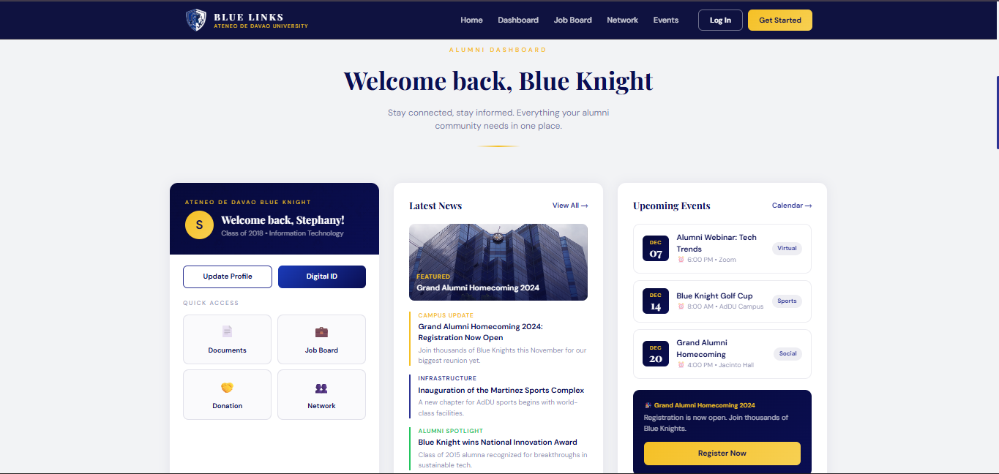
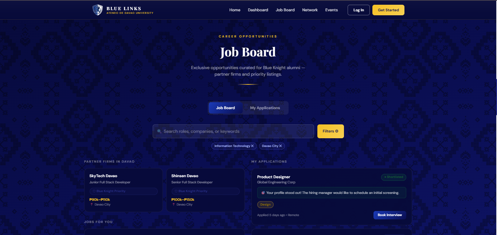
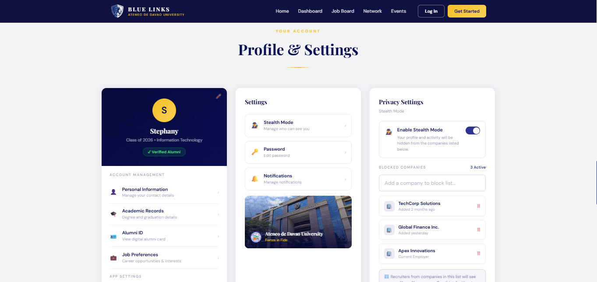
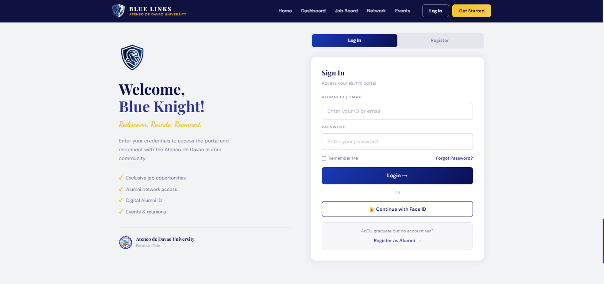
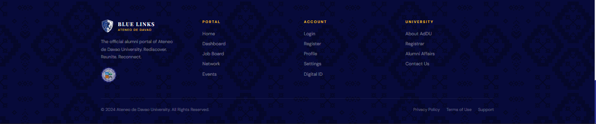

 
## Blue Links

Framework: Next.js (React) <br> 
Module: 4 - Job Posting (Blue Links) <br>
AI Tools Used: Claude AI, Qwen

---

## Project Overview

Blue Links is a modern, responsive web-based alumni portal prototype designed for Ateneo de Davao University (AdDU). It serves as a digital hub where graduates can reconnect, explore job opportunities, manage their profiles, and stay updated on university events — all through an intuitive, visually rich interface inspired by AdDU’s branding and cultural motifs (like the Bagobo pattern).

This project was developed not just to build functionality, but to explore the “vibe” and subjective experience of coding alongside different AI models — specifically Claude AI and Qwen. The goal was to understand how each AI influences code structure, design decisions, debugging style, and overall developer flow.

---

## How Does It Work?

The application is built using Next.js (App Router) with inline styles and Tailwind CSS utilities for rapid UI development. Key features include:
- Responsive Navigation & Footer: Consistent across pages, featuring gold-accented links and a subtle Bagobo-pattern overlay for cultural identity.
- Job Board Module: Displays mock job postings with filtering capabilities (by category, location, etc.).
- User Dashboard: Personalized view showing saved jobs, profile status, and event reminders.
- Authentication Flow: Login/Register screens leading to protected routes like Profile and Settings.
- Static Asset Integration: Images (blue-knight.png, bagobo-pattern.png) are served from the /public/images folder, ensuring fast loading and offline compatibility during development.
All components were generated via AI prompts, then manually reviewed, adjusted, and assembled to ensure coherence, accessibility, and visual fidelity to the original Activity #10 design.

---

## Prerequisites

Before running this project, ensure you have the following installed on your computer:
- **Node.js** (Version 18.0 or higher): [Download here](https://nodejs.org/)
- **npm** (Comes with Node.js)
- **Git**: [Download here](https://git-scm.com/)

*(If you are unsure if you have Node.js installed, open your terminal/command prompt and type `node -v`. If it returns a version number, you are good to go!)*

---

## Installation

Follow these steps to replicate this repo and run it on a different computer:

1. Clone the repository:
   ```bash
   git clone https://github.com/donbea/firstattempt2026_Donton.git

3. Navigate to the project directory:
   ```bash
   cd firstattempt2026_Donton

5. Install dependencies:
   Ensure you have Node.js installed. Then run:
   ```bash
   npm install

6.  Make sure you are in the right folder. Then run:
      ```bash
      npm run dev
      ```
   
5. Open your browser: <br>
   Visit http://localhost:3000 to view the application.


## Prompt Documentation
Very First Prompt:
"Create a basic Next.js project structure with a homepage and a footer component. The footer should have a dark blue background (#070A3A) and gold accents."
Final Prompt (Generated Entire Working Project)
"Act as a senior frontend developer. Create a complete 'Blue Links' alumni portal using Next.js and Tailwind CSS.

Requirements:
1. A responsive Footer component with sections for Portal, Account, and University links.
2. Use specific styling: Background #070A3A, Gold text variables, and a subtle Bagobo pattern overlay.
3. Include a Hero section and a Dashboard placeholder.
4. Ensure all images are loaded from the public folder.
5. Provide the full code for all pages.


## Design Reference
The design implemented in this web application is based on the UI/UX mockups submitted in Activity #10.
- Color Palette: Deep Blue (#070A3A), Gold (var(--gold)), White.
- Typography: Playfair Display for headings, Sans-serif for body text.
- Assets: Uses bagobo-pattern.png and blue-knight.png from the public/images folder.


## Screenshots
Below are official actual screenshots of the web application (including the entire browser window).

1. Hero Section


2. Dashboard


3. Job Board


4. Profile and Settings


5. Log in


6. Footer



